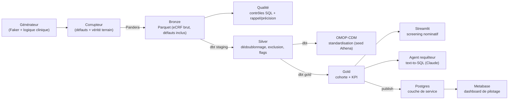
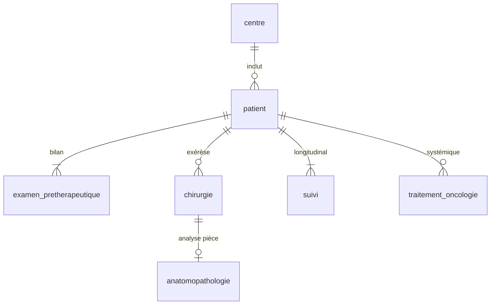

# KidneyVault

[](https://kidneyvault-synthetic-medical-data-rwhxgvuxwbnw4tir7sd9dp.streamlit.app/)
[](https://github.com/behramkorkut/kidneyvault-synthetic-medical-data/actions/workflows/ci.yml)


**Entrepôt de données de santé (EDS) de recherche oncologique simulé**, inspiré
des réseaux multicentriques français de recherche sur le cancer du rein.
Le projet reproduit la chaîne complète d'un data management clinique : modélisation
eCRF → génération de données synthétiques sous contraintes métier → contrats de
données → injection contrôlée de défauts → contrôle qualité mesuré →
transformations dbt (Medallion) → screening de cohortes et pilotage décisionnel.

> ⚠️ **Toutes les données sont 100 % synthétiques.** ⚠️ Aucune donnée réelle de
> patient n'est utilisée ni accessible. Le modèle s'inspire de structures
> cliniques publiques à des fins pédagogiques et de démonstration.

## Démo live (sans installation)

**▶ [Tester l'application dans le navigateur](https://kidneyvault-synthetic-medical-data-rwhxgvuxwbnw4tir7sd9dp.streamlit.app/)**

Screening de cohortes, tableaux de bord, et surtout le **requêteur en langage
naturel** (agent IA) : posez une question en français, l'agent la traduit en SQL
gouverné (lecture seule, validé, affiché). L'app **s'auto-amorce** au premier
chargement — elle construit elle-même tout son pipeline (~1 min).

---

## Pourquoi ce projet

Les EDS multicentriques (60+ centres, données de vie réelle) posent des
problèmes très concrets : données manquantes non aléatoires, incohérences de
saisie inter-tables, doublons inter-centres, conformité réglementaire (RGPD,
pseudonymisation). KidneyVault simule cet environnement de bout en bout et
démontre une idée directrice : **chaque règle métier documentée devient un
contrat exécutable, puis un test, puis un contrôle qualité mesurable.**

Fil rouge du projet : on génère des données *propres*, on y injecte des défauts
*réalistes et tracés*, et on prouve que la couche qualité les détecte — avec un
rappel et une précision chiffrés, pas une simple intuition.

## Architecture

Le projet suit l'architecture **Medallion** (Bronze → Silver → Gold), avec une
séparation nette entre l'entrepôt analytique (DuckDB) et la couche de service
décisionnelle (Postgres).



| Couche | Contenu | Statut |
|---|---|---|
| **Génération** | EDS synthétique 7 tables, parcours-centré, reproductible | ✅ |
| **Corruption** | Injection contrôlée de 4 familles de défauts + vérité terrain | ✅ |
| **Bronze** | Tables sources (défauts inclus), validées Pandera, Parquet | ✅ |
| **Qualité** | Contrôles SQL/DuckDB + indicateurs + évaluation rappel/précision | ✅ |
| **Silver** (dbt) | Dédoublonnage, exclusion des anomalies, flags de divergence | ✅ |
| **OMOP-CDM** (dbt) | Standardisation vers le modèle commun (person, condition, procedure, drug, measurement, death) | ✅ |
| **Gold** (dbt) | Cohorte d'analyse à plat + KPI agrégés | ✅ |
| **Screening** | Application Streamlit d'extraction de cohortes | ✅ |
| **Pilotage** | Couche de service Postgres + dashboard Metabase | ✅ |
| **Agent requêteur** | Text-to-SQL en langage naturel (Claude), garde-fous testés | ✅ |
| **Export eCRF** | Data Dictionary REDCap généré depuis les contrats Pandera | ✅ |
| **Orchestration** | Dagster (assets, lineage, planification) | 🔜 |
| **Agent extracteur** | Texte clinique libre → JSON validé Pandera | 🔜 |

### Les deux contrats, complémentaires

| | Pandera (Python) | dbt tests (entrepôt) |
|---|---|---|
| **Portée** | Intra-table (types, énumérations, règles inter-colonnes) | Inter-tables (`relationships`, unicité, intégrité référentielle) |
| **Moment** | À la génération / ingestion | Dans l'entrepôt, à chaque build |

Argument central du projet : les défauts réalistes (doublon inter-centres,
chirurgie antérieure au bilan, divergence imagerie/anapath) **passent tous les
contrats Pandera** — ils vivent *entre* les tables ou dans des *patterns*
statistiques. D'où une couche qualité SQL dédiée, dont l'efficacité est
**mesurée** contre la vérité terrain du corrupteur (rappel et précision par
type de défaut).

### Résultats mesurés de la couche qualité

Sur la configuration de référence (`uv run python -m kidneyvault.evaluation`) :

| Défaut injecté | Injectés | Détectés | Rappel | Précision |
|---|---|---|---|---|
| `chirurgie_avant_examen` | 3 | 3 | 100 % | 100 % |
| `divergence_taille_imagerie_anapath` | 3 | 3 | 100 % | 100 % |
| `doublon_inter_centres` | 2 | 2 | 100 % | 100 % |

Les défauts *de pattern* (complétude dégradée du score R.E.N.A.L. selon le type
de centre) ne sont pas évaluables ligne à ligne — un `null` isolé est licite —
et sont suivis par un **indicateur** dédié (complétude par centre), pas par un
contrôle booléen. Le rappel de 100 % n'est pas une fin en soi : c'est un
*harnais de mesure* qui détecte immédiatement toute régression d'un contrôle.

### La standardisation OMOP-CDM

La couche `dbt/models/omop/` mappe la Silver vers le **modèle commun OMOP-CDM**
(OHDSI), le standard d'interopérabilité des EDS français : `person`,
`condition_occurrence`, `procedure_occurrence`, `drug_exposure`, `measurement`,
`death`. Chaque fait clinique porte la double colonne OMOP — `*_concept_id`
(concept *standard*) et `*_source_value` (valeur d'origine préservée).

Le cœur d'OMOP n'est pas la structure mais le **vocabulaire** : chaque valeur
source est traduite en concept standard (SNOMED, RxNorm…). La correspondance est
curée depuis [Athena](https://athena.ohdsi.org) et versionnée dans un **seed**
(`source_to_concept_map`, à la manière de la table OMOP `SOURCE_TO_CONCEPT_MAP`)
— ex. *Néphrectomie partielle* → `4304536`, *Sunitinib* → `1336539`. Ce qui n'a
pas de concept standard (score R.E.N.A.L., grade ISUP) reste en `concept_id = 0`
avec sa `value_as_number` et son `source_value` : la convention OMOP, pas un
pis-aller. `race`/`ethnicity` sont à `0` — non collectées en France (interdit).

> En production, on chargerait les vocabulaires Athena complets pour automatiser
> et valider le mapping ; le seed curé couvre ici les quelques valeurs synthétiques.

### L'agent requêteur (text-to-SQL)

Un agent traduit une question en langage naturel (« les patients âgés avec une
récidive au poumon ») en SQL exécuté sur la couche Gold, via l'API Claude.
L'IA *propose*, le pipeline *dispose* — défense en profondeur :

- **lecture seule** : la connexion DuckDB rejette physiquement toute écriture ;
- **validation du SQL** avant exécution : une seule instruction, `SELECT`/`WITH`
  uniquement, mots-clés de mutation interdits (testée hors-ligne, sans appel LLM) ;
- **sortie structurée** : l'agent déclare ses hypothèses d'interprétation et les
  parties de la question qu'il ne peut pas satisfaire (anti-dérapage sémantique) ;
- **transparence** : le SQL exécuté est toujours affiché à l'utilisateur.

> ⚠️ Démonstration sur données 100 % synthétiques, donc sans enjeu RGPD. En
> production santé, le modèle serait **auto-hébergé sur infrastructure HDS**
> (aucune sortie de donnée patient) — voir feuille de route.

### L'export eCRF REDCap

Les mêmes contrats Pandera génèrent un **Data Dictionary REDCap** importable
(`kidneyvault.redcap_dictionary`) : chaque colonne devient un champ d'eCRF, et
les contraintes deviennent la configuration de saisie — énumération → liste
déroulante à choix codés, bornes → validation min/max, nullabilité → champ
requis, clé de pseudonymisation → flag *Identifier*. Les règles de cohérence
inter-champs (`@pa.dataframe_check`) sont traduites en **branching logic**
(ex. la localisation de récidive ne s'affiche que si une récidive est saisie) :
la qualité passe ainsi *à la source*, à la saisie, en complément de la détection
en aval du pipeline. Une seule source de vérité, du contrat Python à l'eCRF.

## Le modèle de données

7 tables cliniques autour de l'entité pivot `patient`, couvrant le parcours
de soin en cancérologie rénale :



Détail (types, nullabilité, énumérations, règles métier) :
[data dictionary](docs/data_dictionary.md). Choix techniques : [ADR](docs/adr/adr1.md).

**Ce qui rend les données crédibles** : le générateur est « parcours-centré ».
Chaque patient tire un profil de gravité (localisé / localement avancé /
métastatique) qui conditionne tout son parcours — taille tumorale et cTNM
cohérents, décision chirurgicale probabiliste, anapath seulement si opéré,
thérapies réservées aux stades avancés, suivi borné par la fenêtre
d'observation. Terminologies réelles : TNM, score R.E.N.A.L., grades ISUP,
Clavien-Dindo, RECIST, molécules du cancer du rein.

## Démarrage rapide

Prérequis : [uv](https://docs.astral.sh/uv/) (gère Python 3.12 et les dépendances).

```bash
git clone https://github.com/behramkorkut/kidneyvault.git
cd kidneyvault
uv sync

# 1. Générer la Bronze (avec injection de défauts) + vérité terrain
uv run python -m kidneyvault.build_bronze

# 2. Couche qualité : contrôles SQL + évaluation rappel/précision
uv run python -m kidneyvault.qualite
uv run python -m kidneyvault.evaluation

# 3. Transformations dbt (staging → silver → gold), avec tests
uv run dbt build --project-dir dbt --profiles-dir dbt

# 4. Screening de cohortes + requêteur IA (interface web Streamlit)
uv run streamlit run app/screening.py

# 5. Générer le Data Dictionary REDCap (eCRF) depuis les contrats Pandera
uv run python -m kidneyvault.redcap_dictionary

# Qualité de code et tests
uv run pytest -v
uv run ruff check .
```

### Agent requêteur (nécessite une clé API Claude)

```bash
export ANTHROPIC_API_KEY=sk-ant-...
uv run python -m kidneyvault.agent_requeteur "Combien de patients métastatiques ?"
# (ou via la page « Requeteur IA » de l'app Streamlit)
```

### Pilotage décisionnel (optionnel, nécessite Docker)

```bash
cp .env.example .env                       # puis renseigner POSTGRES_PASSWORD
docker compose up -d                       # Postgres + Metabase
uv run python -m kidneyvault.publish       # publie les tables Gold vers Postgres
# Metabase : http://localhost:3000  (source Postgres → hôte « postgres », port 5432)
```

Aucun identifiant n'est committé : les secrets vivent dans `.env` (ignoré par
Git) ; `.env.example` sert de modèle. Le `docker-compose.yml` et `publish.py`
les lisent via variables d'environnement.

La génération est **déterministe** (graine fixée) : deux exécutions produisent
exactement les mêmes données et les mêmes défauts — reproductibilité scientifique.

### Démo live (Streamlit Community Cloud)

L'application se déploie en un clic et **s'auto-amorce** : au premier démarrage,
elle génère la couche Bronze puis matérialise les modèles dbt
(`kidneyvault.bootstrap`), exactement comme le pipeline local — rien à
provisionner. Un décideur non technique peut ainsi tester le projet directement
dans son navigateur.

Déploiement : pointer une app sur [share.streamlit.io](https://share.streamlit.io)
vers `app/screening.py` (Python 3.12), puis ajouter `ANTHROPIC_API_KEY` en
*secret* pour activer la page Requêteur IA. Les dépendances sont décrites par
`requirements.txt` (installe le package local et toutes ses dépendances).

## Structure du dépôt

```
kidneyvault/
├── src/kidneyvault/
│   ├── schemas.py        # contrats Pandera (7 tables, règles inter-colonnes)
│   ├── generator.py      # générateur synthétique sous contraintes cliniques
│   ├── corrupteur.py     # injection de défauts + rapport de vérité terrain
│   ├── qualite.py        # exécution des contrôles SQL (DuckDB sur Parquet)
│   ├── evaluation.py     # rappel/précision des contrôles vs vérité terrain
│   ├── persist.py        # persistance Parquet (couche Bronze)
│   ├── build_bronze.py   # pipeline Bronze (génération + corruption)
│   ├── publish.py        # publication Gold → couche de service Postgres
│   ├── agent_requeteur.py # agent text-to-SQL (Claude) + garde-fous
│   ├── redcap_dictionary.py # export Data Dictionary REDCap (eCRF)
│   └── bootstrap.py       # auto-amorçage du warehouse (déploiement)
├── sql/
│   ├── qualite/          # un contrôle de cohérence = un fichier SQL
│   └── indicateurs/      # indicateurs agrégés (ex. complétude par centre)
├── dbt/
│   ├── models/
│   │   ├── staging/      # interfaces 1:1 sur la Bronze + tests de schéma
│   │   ├── silver/       # dédoublonnage, exclusion, flags de divergence
│   │   ├── omop/         # standardisation OMOP-CDM (person, condition…)
│   │   └── gold/         # cohorte d'analyse + KPI de pilotage
│   └── seeds/            # source_to_concept_map (mapping Athena curé)
├── app/
│   ├── screening.py      # interface Streamlit d'extraction de cohortes
│   └── pages/            # page « Requeteur IA » (text-to-SQL)
├── docker-compose.yml    # couche de service (Postgres + Metabase)
├── tests/                # contrats, générateur, corrupteur, chaîne qualité
├── docs/                 # data dictionary + ADR
└── data/                 # couches Medallion (jamais committées — réflexe RGPD)
```

## Principes appliqués

- **Spec → contrat → test → contrôle → eCRF** : chaque règle métier est encodée
  en schéma Pandera, couverte par un test pytest, vérifiée par un contrôle SQL ou
  un test dbt, et exportée jusqu'à la configuration de saisie REDCap — une seule
  source de vérité, de la documentation à l'instrument de collecte.
- **Qualité mesurée, pas supposée** : la couche qualité est évaluée objectivement
  (rappel/précision) contre une vérité terrain connue.
- **Quarantaine, jamais suppression** : en Silver, les anomalies sont exclues ou
  flaguées selon une règle documentée ; rien n'est effacé silencieusement.
- **Logique dans l'entrepôt, outils interchangeables** : aucune agrégation dans
  Streamlit ni Metabase — ils ne font que lire des modèles dbt testés.
- **IA encadrée** : l'agent requêteur ne reçoit jamais d'accès direct en écriture ;
  il génère du SQL en lecture seule, validé par un garde-fou et affiché à
  l'utilisateur. La même logique propose/valide que dans tout le pipeline.
- **Reproductibilité** : Python épinglé, lock file, graines fixes, date
  d'extraction simulée constante.
- **Aucune donnée dans Git** : même synthétiques, les données restent hors du
  dépôt — la discipline attendue en environnement santé.

## Feuille de route

1. **Agent extracteur** : compte-rendu clinique en texte libre → JSON structuré
   validé par les contrats Pandera (l'usage LLM le plus utile en data management
   clinique), avec exécution sur modèle auto-hébergé en infra HDS.
2. Mapping OMOP complet via les vocabulaires Athena chargés (concept mapping
   automatisé et validé, au-delà du seed curé actuel).
3. Orchestration Dagster (assets, lineage, planification des runs)
4. Extension de la CI au lint SQL (sqlfluff)

## Stack

`uv` · `Polars` · `Faker` · `Pandera` · `DuckDB` · `dbt` · `OMOP-CDM` ·
`Streamlit` · `Postgres` · `Metabase` · `Docker` · `API Claude` · `REDCap` ·
`pytest` · `ruff` · GitHub Actions
